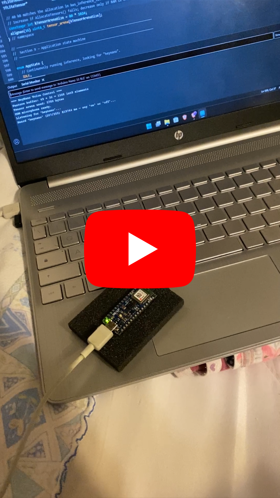

# KeywordSpotting
This project implements a Keyword Spotting (KWS) pipeline inspired by the approach used in Edge Impulse, but implemented entirely in TensorFlow.
The final goal is to deploy the trained model on an embedded device such as the Arduino Nano 33 BLE Sense Rev2.

The pipeline includes:
1. Audio data collection
2. Feature extraction using LFBE
3. Neural network training for keyword classification
4. Deployment on an embedded microcontroller

## Video demo
<p align="center">
  <a href="https://www.youtube.com/shorts/y28ZhxwPF1U">
    
  </a>
</p>

## Requirements
This project was developed using:
- Python 3.12.10
- TensorFlow (CPU version)

## Environment Setup
On Windows, create and activate a virtual environment with Python 3.12:
```bash
py -3.12 -m venv venv
```
Activate the virtual environment:
```bash
.\venv\Scripts\activate
```
Upgrade pip:
```bash
python -m pip install --upgrade pip
```
Install TensorFlow (CPU version):
```bash
pip install tensorflow
```
Install all dependencies:
```bash
pip install -r requirements.txt   
```

## Getting Started
Clone the repository:
```bash
git clone https://github.com/NicoNRG2/KeywordSpotting.git
cd KeywordSpotting
```
After setting up the environment, you can start working directly from the provided Jupyter notebook "KWS_LowPower.ipynb", which contains the main experimentation pipeline.

## Deployment on Arduino nano 33 ble sense rev2
### Install TensorFlow Lite Micro Library
Inside Arduino libraries folder on your system type:
```bash
git clone https://github.com/tensorflow/tflite-micro-arduino-examples Arduino_TensorFlowLite
```
### Compile and upload sketch
Open and upload on Arduino IDE the sketch heynano_voice_control in this repository.

## Report
Click the link to view the final [Report](docs/Report_low_power.pdf)